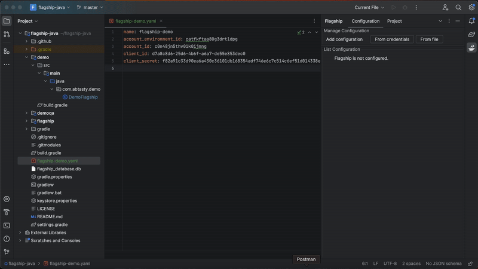
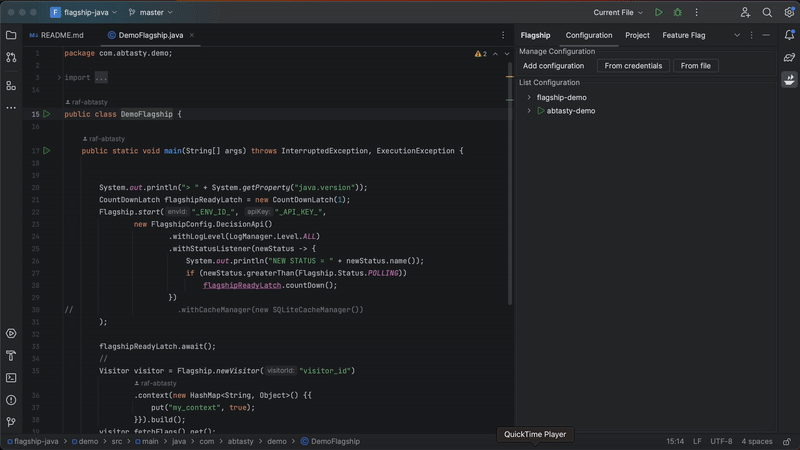
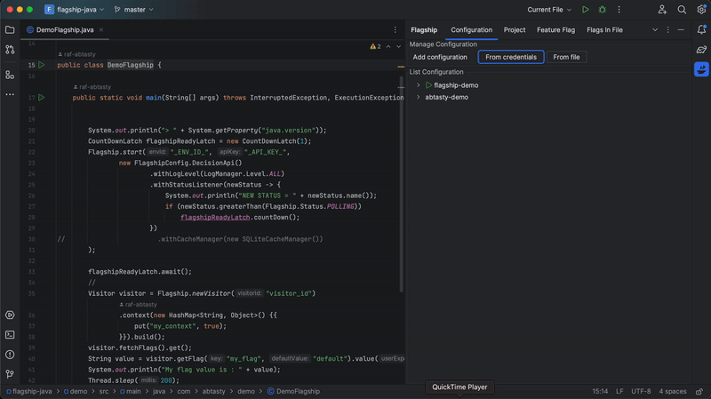
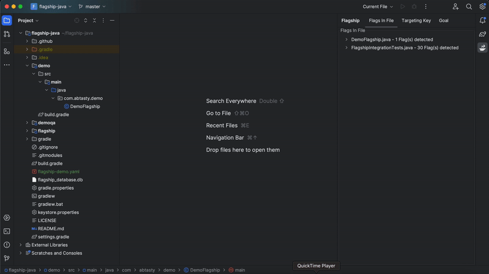
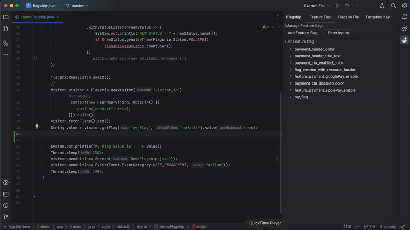
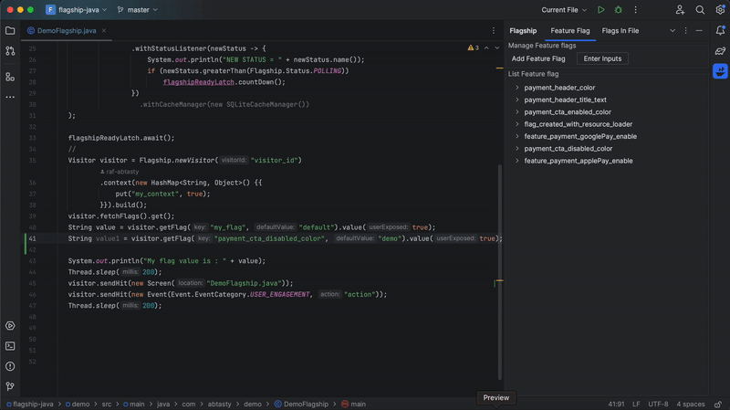

# Flagship for Jetbrain

#### Disclaimer

> ⚠️ **Beta phase**
>
> Please note that as a beta phase, it may still contain some bugs and imperfections. Your feedback is instrumental in helping us identify and resolve any issues, so don't hesitate to report them by mail product.feedback@abtasty.com or open a ticket issue at [Github issues](https://github.com/flagship-io/flagship-code/issues)
>

## Overview

[Flagship](https://www.abtasty.com/feature-experimentation) optimization platform lets you manage, release, and experiment with features across all codebases and devices to drive growth with every deployment. This extension is designed to enhance your productivity within the Jetbrain environment, it offers a comprehensive set of utilities that simplify the management and utilization of feature flags using Flagship and let you handle most aspects of feature flag workflows directly within Jetbrain, eliminating the need to switch between your coding environment and the platform.

<!-- Plugin description -->

This plugin is designed to help you use Flagship, directly in the Jetbrain environment. It will simplify the management and utilization of feature flags by eliminating the need to switch between your coding environment and the platform.

<!-- Plugin description end -->

## Features

- Manage your configurations which is a combination of the Flagship Client ID, Client Secret, Account ID, Account Environment ID (To set up your credentials follow these [instructions](https://flagship.zendesk.com/hc/en-us/articles/4499017687708--Acting-on-your-account-remotely) or check this [documentation](https://docs.developers.flagship.io/docs/manage-configurations-jetbrain#overview)).
  To create a configuration:

  

  To change configurations:

  

- Manage your Flagship resources (Project, Feature Flags, Targeting Keys, Goals).

  

- Check feature flags in your files. This feature gives you information on the flags in your current working file and retrieve the flag directly in the code.

  

- Autocomplete for feature flags.

  

- Hover your feature flags.

  

## Documentation

Check out our [documentation](https://docs.developers.flagship.io/docs/flagship-jetbrain) for further explanation.

## Installation

- Using the IDE built-in plugin system:

  <kbd>Settings/Preferences</kbd> > <kbd>Plugins</kbd> > <kbd>Marketplace</kbd> > <kbd>Search for "
  flagship-jetbrain"</kbd> >
  <kbd>Install</kbd>

- Manually:

  Download the [latest release](https://github.com/flagship-io/flagship-jetbrain/releases/latest) and install it
  manually using
  <kbd>Settings/Preferences</kbd> > <kbd>Plugins</kbd> > <kbd>⚙️</kbd> > <kbd>Install plugin from disk...</kbd>

---
Plugin based on the [IntelliJ Platform Plugin Template][template].

[template]: https://github.com/JetBrains/intellij-platform-plugin-template

[docs:plugin-description]: https://plugins.jetbrains.com/docs/intellij/plugin-user-experience.html#plugin-description-and-presentation

## Contributors

- Chadi Laoulaou [@Chadiii](https://github.com/chadiii)

## Contributing

We encourage any form of contribution, whether that be issues, comments, or pull requests.

## Licence

[Apache License.](https://github.com/flagship-io/flagship-jetbrain/blob/main/LICENSE.md)
